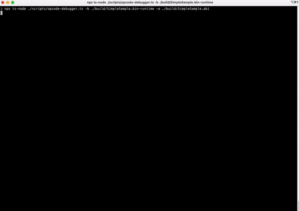

# Quick Start

```shell
solc  ./contracts/sample.sol -o ./build  --overwrite --bin-runtime --abi
npx ts-node ./scripts/opcode-debugger.ts -b ./build/SimpleSample.bin-runtime -a ./build/SimpleSample.abi
```


